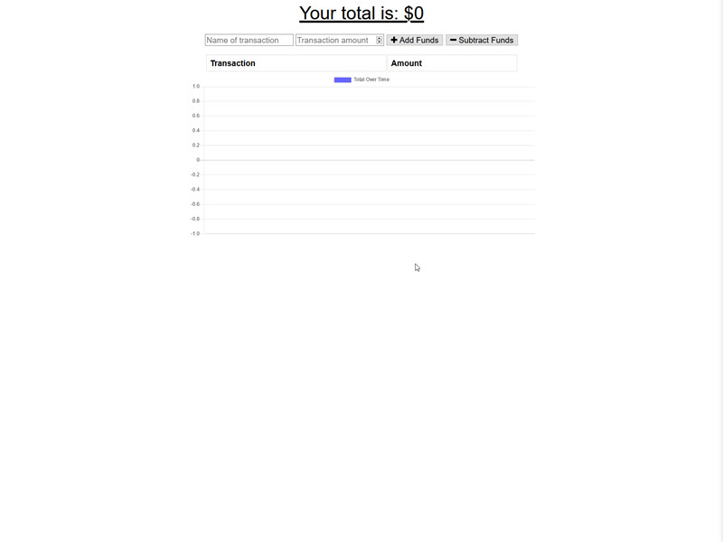
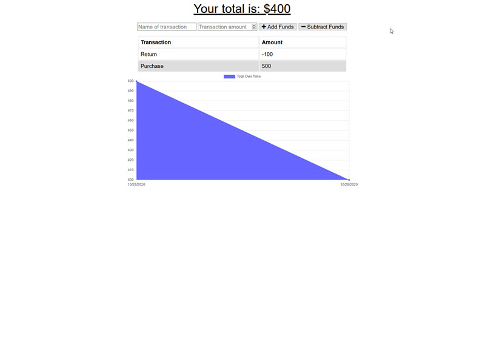

# Title
Progressive Budget Tracker

## App
https://cjb-progressive-budget-tracker.herokuapp.com/

## Description
Progressive Budget Tracker is a simple progressive web application (PWA) that allows users to keep track of their income and expenses online and offline.  In the case of the latter, once internet connectivity is reestablished, any offline data will be submitted to the database.

## Motivation
I undertook this project to increase my knowledge and understanding of progressive web applications using Node.js and Express as part of my coding boot camp program.  The project uses a number of native and third party modules and API and HTML routes.  While the app itself is not groundbreaking, the code may be particularly interesting to those trying to learn or who have a basic understanding of HTML, CSS, JS, Node.js, and Express, MongoDB, and Morgan.

## User Story
**As a** user,

**I want to** be able to maintain accurate records of my income and expenses, both online and offline,

**So I can** I know what my true financial status is at any moment in time.

## Acceptance Criteria
The application should allow users to:
+ enter income online and offline;
+ enter expenses online and offline; and
+ reconcile offline entries to the database once the applications gets back online.

## Screen Shots
+ 
+ 

## Built With
+ HTML
+ CSS
+ JavaScript
+ Node.js
+ Express
+ MongoDB
+ Morgan

## Prerequisites
No special hardware or software is required to use this web app.  All that is required is a modern browser and installation of the node packages.

## Installation
The app does not need to be installed.  It can be run directly from the browser.  If you choose to download the app files to view and possibly play with the code, do not forget to run npm install so all node modules required to run the app locally are installed.

## Contributors
[Christopher Bourque](https://github.com/christopherjbourque)

## License
The Unlicense

## Project Status
Active